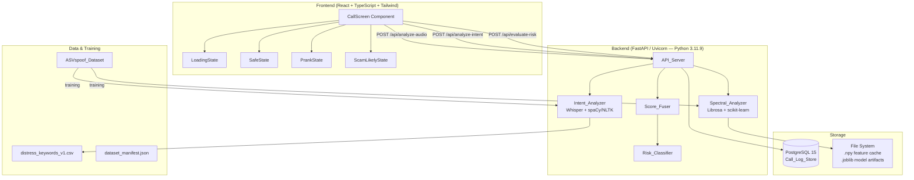
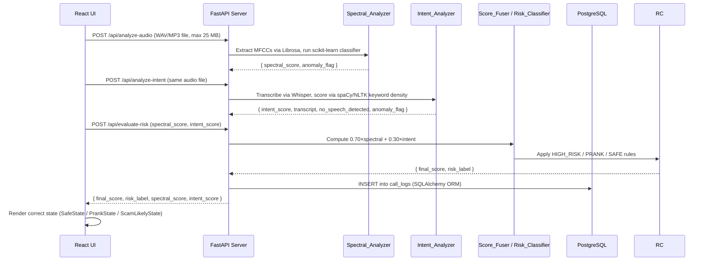

# Design Document — Project S.A.F.E.

## Overview

Project S.A.F.E. (Synthetic Audio Fraud Engine) is a dual-layer contextual risk engine that detects AI voice-cloning scams while filtering out harmless pranks. The system processes incoming audio through two independent analysis layers, fuses their scores, and surfaces a single actionable risk label to the user.

**Core flow:**

```
Audio Input
    │
    ├──► Layer 1: Spectral_Analyzer  ──► spectral_score [0–100]
    │         (Librosa MFCCs + scikit-learn binary classifier)
    │
    ├──► Layer 2: Intent_Analyzer    ──► intent_score   [0–100]
    │         (Whisper transcription + spaCy/NLTK keyword scoring)
    │
    └──► Score_Fuser  ──► final_score = 0.70×spectral + 0.30×intent
              │
              └──► Risk_Classifier  ──► risk_label: HIGH_RISK | PRANK | SAFE
```

**Risk classification rules:**

| Condition | Label |
|---|---|
| final_score > 75 AND intent_score > 60 | `HIGH_RISK` |
| final_score > 75 AND intent_score < 40 | `PRANK` |
| All other cases | `SAFE` |

**Design goals:**
- Prevent "cry wolf" fatigue by separating synthetic-voice detection from coercion-intent detection.
- Keep each layer independently testable and replaceable.
- Expose all ML logic through a clean FastAPI surface so the UI and future consumers never touch model internals.
- Persist every analysis result for auditability and model retraining.

---

## Technology Stack

| Layer | Technology | Rationale |
|---|---|---|
| Language | Python 3.11.9 | 10–60% faster execution than 3.10; stable for all ML dependencies |
| API Framework | FastAPI + Uvicorn | Native async support; auto-generates OpenAPI docs; Pydantic validation built-in |
| Database | PostgreSQL 15 | Enterprise-grade; supports future pgvector extension for audio embeddings |
| ORM | SQLAlchemy 2.x | Pythonic DB access; single-line swap to SQLite for tests via DATABASE_URL env var |
| DB Adapter | psycopg2-binary | Standard PostgreSQL driver for Python |
| Audio Features | Librosa | Industry-standard MFCC and spectrogram extraction |
| Transcription | OpenAI Whisper (base) | Offline, accent-robust speech-to-text; no cloud API dependency |
| NLP | spaCy + NLTK | NER, dependency parsing, and keyword matching for urgency detection |
| ML Models | scikit-learn | Random Forest / Gradient Boosting classifiers; K-Means for anomaly clustering |
| Model Storage | Joblib | Efficient serialization of scikit-learn model artifacts |
| Feature Storage | NumPy (.npy) | Lossless binary format for MFCC feature arrays |
| Frontend | React 18 + TypeScript | Component-based; TypeScript enforces API contract at compile time |
| Styling | Tailwind CSS | Utility-first; rapid high-contrast alert screen development |
| Build Tool | Vite | Fast HMR dev server; optimized production builds |
| Infrastructure | Docker Compose | Reproducible local PostgreSQL environment across all team machines |
| Testing | pytest + Hypothesis | pytest-asyncio for async endpoints; Hypothesis for property-based invariant testing |

---

## Architecture

### High-Level Component Diagram



### Request Lifecycle



### Three-Team Parallel Workstreams

| Team | Owns | Works With | Integration Point |
|---|---|---|---|
| UI & System Architect | React UI, Tailwind screens, mock data layer, state transitions | Vite, React 18, TypeScript, Tailwind CSS | Consumes `/api/evaluate-risk` JSON response shape; builds against mock data until backend is live |
| Core ML Architect | Spectral_Analyzer, Intent_Analyzer, Score_Fuser, Risk_Classifier | Librosa, Whisper, spaCy, NLTK, scikit-learn, Joblib, NumPy | Exposes Python modules with stable interfaces consumed by the API_Server |
| Data Pipeline & Backend API | Dataset prep, FastAPI endpoints, SQLAlchemy models, Docker | FastAPI, SQLAlchemy, PostgreSQL, psycopg2-binary, Docker Compose | Provides stable API contract and DB schema; wraps ML modules into HTTP endpoints |

---

## Components and Interfaces

### 1. Spectral_Analyzer

**Technology:** Librosa (MFCC extraction), scikit-learn (Random Forest or Gradient Boosting binary classifier), NumPy (feature arrays), Joblib (model serialization).

**Responsibilities:** Load a WAV or MP3 audio file, extract 40 MFCC coefficients across all time frames using Librosa, mean-pool the feature array into a single vector, pass it to a trained scikit-learn binary classifier, and return a spectral_score in [0, 100] representing the probability of synthetic origin. Also applies K-Means clustering to flag acoustic anomalies.

**Key behaviors:**
- Accepts audio file paths as input; supports WAV and MP3 formats.
- Extracts a 2D MFCC array of shape (40, time_frames) with dtype float32.
- Mean-pools the array to a 1D vector of shape (40,) before classifier inference.
- Maps the classifier's synthetic-class probability (0.0–1.0) to a 0–100 score by multiplying by 100.
- Raises a structured AudioProcessingError (with error_code and description fields) for corrupt, empty, or unsupported-format inputs.
- Enforces a 5-second processing timeout for audio up to 60 seconds long.
- Serializes the trained classifier to `models/spectral_model.joblib` and loads it at startup.
- Serializes extracted MFCC arrays to `.npy` files for caching; deserializes them with identical shape and dtype.

**Output fields:** spectral_score (float, [0, 100]), anomaly_flag (bool), processing_time_ms (int).

---

### 2. Intent_Analyzer

**Technology:** OpenAI Whisper base model (transcription), spaCy and NLTK (NLP scoring), scikit-learn (supervised intent classifier), Joblib (model serialization).

**Responsibilities:** Transcribe the audio file using Whisper, load the Distress_Keyword_Set CSV at startup, compute a weighted keyword density score combined with urgency linguistic pattern detection (imperative verbs, time-pressure phrases via spaCy dependency parsing and NLTK), and return an intent_score in [0, 100].

**Key behaviors:**
- Loads `distress_keywords_v1.csv` once at startup; each keyword has a category and a weight between 0.6 and 1.0.
- Runs Whisper transcription locally — no internet connection required.
- Returns intent_score = 0 and no_speech_detected = True when Whisper detects no intelligible speech (silence or pure noise).
- Raises a structured AudioProcessingError for corrupt, empty, or unsupported-format inputs.
- Enforces a 10-second processing timeout for audio up to 60 seconds long.
- Applies K-Means clustering to text-derived TF-IDF or spaCy embedding vectors to detect linguistic anomalies; sets anomaly_flag = True when applicable.
- Serializes the trained intent scoring model to `models/intent_model.joblib`.

**Output fields:** intent_score (float, [0, 100]), transcript (str), no_speech_detected (bool), anomaly_flag (bool), processing_time_ms (int).

---

### 3. Score_Fuser

**Technology:** Pure Python arithmetic — no external library required.

**Responsibilities:** Accept a spectral_score and an intent_score, both validated to be in [0, 100], and compute the weighted fusion: `final_score = (0.70 × spectral_score) + (0.30 × intent_score)`. Raises a ValueError if either input is outside [0, 100].

**Weights:** Spectral layer carries 70% weight (primary synthetic-origin signal); Intent layer carries 30% weight (contextual coercion signal).

**Output:** final_score (float, guaranteed in [0, 100]).

---

### 4. Risk_Classifier

**Technology:** Pure Python conditional logic — no external library required.

**Responsibilities:** Accept a final_score and an intent_score and return exactly one of three risk labels based on exhaustive, mutually exclusive rules.

**Classification rules:**
- Returns HIGH_RISK when final_score > 75 AND intent_score > 60 — synthetic voice combined with strong coercion signals.
- Returns PRANK when final_score > 75 AND intent_score < 40 — synthetic voice with harmless or casual content.
- Returns SAFE in all other cases — either the voice is not synthetic, or the coercion signal is ambiguous.

No input pair in [0, 100] × [0, 100] shall produce an unclassified result or raise an exception.

**Output:** risk_label — one of HIGH_RISK, PRANK, or SAFE.

---

### 5. API_Server

**Technology:** FastAPI 0.110+ with Uvicorn, Pydantic v2 for request/response validation, python-multipart for audio file uploads.

**Responsibilities:** Expose three REST endpoints, validate all inputs, route requests to the appropriate ML components, persist results to PostgreSQL, and return clean JSON responses that the React frontend can directly map to UI states.

**Endpoints:**

| Method | Path | Input | Output |
|---|---|---|---|
| POST | `/api/analyze-audio` | Multipart audio file (WAV/MP3, max 25 MB) | `{ spectral_score, anomaly_flag }` |
| POST | `/api/analyze-intent` | Multipart audio file (WAV/MP3, max 25 MB) | `{ intent_score, transcript, no_speech_detected, anomaly_flag }` |
| POST | `/api/evaluate-risk` | JSON body: `{ spectral_score, intent_score, caller_id?, audio_file_path? }` | `{ final_score, risk_label, spectral_score, intent_score }` |

**Validation and error handling:**
- All score fields validated to be floats in [0, 100] via Pydantic Field constraints (ge=0, le=100).
- Missing or out-of-range fields return HTTP 422 with a structured JSON error body identifying the field and reason.
- AudioProcessingError from either analyzer returns HTTP 422 with the error_code and description.
- Database write failures return HTTP 500 with a generic message; full exception is logged with the request identifier.
- A 15-second overall response timeout is enforced at the FastAPI middleware level.

---

### 6. Call_Log_Store

**Technology:** PostgreSQL 15, SQLAlchemy 2.x ORM, psycopg2-binary adapter.

**Responsibilities:** Persist one record per completed risk evaluation. The schema enforces data integrity via CHECK constraints and UUID primary keys.

**call_logs table schema:**

| Column | Type | Constraints |
|---|---|---|
| id | UUID | Primary key, auto-generated UUID v4, unique |
| timestamp | DateTime (timezone-aware) | Not null, stored in UTC |
| caller_id | String | Nullable |
| audio_file_path | String | Not null |
| transcript | Text | Nullable |
| spectral_score | Float | Not null, CHECK [0, 100] |
| intent_score | Float | Not null, CHECK [0, 100] |
| final_score | Float | Not null, CHECK [0, 100] |
| risk_label | Enum | Not null; one of HIGH_RISK, PRANK, SAFE |
| anomaly_flag | Boolean | Default false |

**Database connection:** Configured via `DATABASE_URL` environment variable. Defaults to PostgreSQL in production; swapped to SQLite in-memory for tests.

---

### 7. Data_Pipeline

**Technology:** Python scripts, ASVspoof dataset, NumPy for array operations, JSON for manifest output.

**Responsibilities:** Split the ASVspoof_Dataset into labeled train/validation/test splits (80/10/10), maintain a separate unlabeled batch for semi-supervised learning, manage the versioned Distress_Keyword_Set CSV, apply pseudo-labels to high-confidence unlabeled samples, and generate a JSON manifest after each run.

**Dataset split rules:**
- Splits are pairwise disjoint — no sample appears in more than one split.
- The union of all splits equals the full input dataset.
- Pseudo-labels are applied only when model confidence ≥ 0.85; samples below this threshold remain in the unlabeled batch.

**Manifest output fields:** run_id (UUID), timestamp (UTC), labeled_count, unlabeled_count, pseudo_labeled_count, pseudo_label_threshold, splits (train/validation/test counts).

---

### 8. React UI

**Technology:** React 18 with TypeScript, Tailwind CSS, Vite. During development, mock JSON responses replace live API calls so the UI Architect can build and test all states independently.

**Responsibilities:** Display the correct visual state based on the risk_label received from the API, show all three numeric scores in every non-loading state, and handle loading/error transitions gracefully.

**UI States:**

| State | Trigger | Visual Design |
|---|---|---|
| Loading | API request in flight | Full-screen neutral background, centered spinner animation, no score values shown, no prior risk label retained |
| SAFE | risk_label == "SAFE" | Clean incoming-call screen, green status indicator, caller info displayed, scores shown in a subtle info panel |
| PRANK / Digital Avatar | risk_label == "PRANK" | Amber-toned screen, "Digital Avatar Detected" header, playful icon, reassuring message, all three scores displayed |
| SCAM LIKELY | risk_label == "HIGH_RISK" | Full-screen red background, bold "SCAM LIKELY" header, pulsing alert icon, "Synthetic Voice + Coercion Detected" message, all three scores displayed prominently |

**Score display:** In all non-loading states, the UI renders final_score, spectral_score, and intent_score as labeled numeric values (e.g., "Fraud Score: 82 / 100 | Voice Synthetic: 91 | Intent Coercion: 74").

**Mock data layer:** A `mockData.ts` file exports one hardcoded response per risk label. A dev-mode toggle in the CallScreen component cycles through all four states (Loading → SAFE → PRANK → HIGH_RISK) so the UI can be fully validated before the backend is connected.

**API integration:** Once the backend is live, the mock data calls are replaced with real fetch/axios calls to the three FastAPI endpoints. Loading state is set on request start and cleared on response or error.

---

## Data Models

### call_logs Table (PostgreSQL)

The call_logs table stores one record per completed risk evaluation. All score columns have database-level CHECK constraints enforcing the [0, 100] range. The id column uses UUID v4 to guarantee global uniqueness. The timestamp column is timezone-aware and stored in UTC.

Fields: id (UUID PK), timestamp (UTC DateTime), caller_id (nullable String), audio_file_path (String), transcript (nullable Text), spectral_score (Float, CHECK 0–100), intent_score (Float, CHECK 0–100), final_score (Float, CHECK 0–100), risk_label (Enum: HIGH_RISK/PRANK/SAFE), anomaly_flag (Boolean, default false).

---

### API Request / Response Schemas

**POST /api/evaluate-risk — Request body:**
- spectral_score: float, required, must be in [0, 100]
- intent_score: float, required, must be in [0, 100]
- caller_id: string, optional
- audio_file_path: string, optional

**POST /api/evaluate-risk — Response body:**
- final_score: float
- risk_label: string (one of HIGH_RISK, PRANK, SAFE)
- spectral_score: float
- intent_score: float

**Error response body (HTTP 422 / 500):**
- error_code: string (e.g., CORRUPT_AUDIO, UNSUPPORTED_FORMAT, VALIDATION_ERROR)
- description: string (human-readable explanation)
- field: string, optional (identifies the invalid field for validation errors)

---

### Distress_Keyword_Set

The keyword resource is maintained as a versioned CSV file (`distress_keywords_v1.csv`) with three columns: keyword, category, and weight. Categories are `financial`, `distress`, and `authority`. Weights range from 0.6 to 1.0 and reflect the relative severity of each keyword as a coercion signal.

Seed keywords: Bail (financial, 1.0), Transfer (financial, 1.0), OTP (financial, 0.9), UPI (financial, 1.0), Money (financial, 0.9), Accident (distress, 0.8), Hospital (distress, 0.8), Help (distress, 0.6), Police (authority, 0.7).

The file is loaded by the Intent_Analyzer at startup. New keywords can be added by incrementing the version number (e.g., `distress_keywords_v2.csv`) without modifying application code.

---

### MFCC Feature Array

MFCC features are stored as NumPy arrays in `.npy` binary format. Each array has shape (40, time_frames) and dtype float32. The round-trip invariant requires that loading a serialized array produces a result that is element-wise numerically equivalent to the original (verified via `np.allclose`), with identical shape and dtype.

---

### Dataset Manifest

After each pipeline run, a JSON manifest is written to disk documenting: run_id (UUID), timestamp (ISO-8601 UTC), labeled_count, unlabeled_count, pseudo_labeled_count, pseudo_label_threshold (0.85), and a splits object with train/validation/test counts.

---

## Correctness Properties

*A property is a characteristic or behavior that should hold true across all valid executions of a system — essentially, a formal statement about what the system should do. Properties serve as the bridge between human-readable specifications and machine-verifiable correctness guarantees. All properties are tested using the Hypothesis library with a minimum of 100 randomly generated examples per property.*

---

### Property 1: MFCC Extraction Produces Valid Output

For any valid audio signal (varying duration, sample rate, and content), the Spectral_Analyzer SHALL return a non-empty 2D NumPy array of dtype float32 with shape (n_mfcc, time_frames) where both dimensions are greater than zero.

**Validates: Requirements 1.1**

---

### Property 2: Spectral Score Range Invariant

For any valid audio input submitted to the Spectral_Analyzer, the returned spectral_score SHALL satisfy 0 ≤ spectral_score ≤ 100.

**Validates: Requirements 1.2**

---

### Property 3: Invalid Audio Produces Structured Error

For any invalid audio input (empty bytes, corrupt data, unsupported format) submitted to either the Spectral_Analyzer or the Intent_Analyzer, the system SHALL raise an AudioProcessingError containing a non-empty error_code string and a non-empty description string.

**Validates: Requirements 1.3, 2.5**

---

### Property 4: Intent Score Range Invariant

For any transcript string (including empty strings, strings with no keywords, and strings with maximum keyword density), the intent scoring function SHALL return an intent_score satisfying 0 ≤ intent_score ≤ 100.

**Validates: Requirements 2.2**

---

### Property 5: Keyword Density Monotonicity

For any base transcript and any non-empty set of Distress_Keyword_Set terms appended to it, the intent_score of the augmented transcript SHALL be greater than or equal to the intent_score of the base transcript.

**Validates: Requirements 2.3**

---

### Property 6: No-Speech Audio Returns Zero Intent Score

For any audio input containing no intelligible speech (silence or pure noise), the Intent_Analyzer SHALL return intent_score == 0 and no_speech_detected == True.

**Validates: Requirements 2.4**

---

### Property 7: Score Fusion Formula Invariant

For any pair (spectral_score, intent_score) where both values are in [0, 100], the Score_Fuser SHALL produce a final_score satisfying `|final_score − (0.70 × spectral_score + 0.30 × intent_score)| < 1e-9` and 0 ≤ final_score ≤ 100. This property is tested with 500 randomly generated examples.

**Validates: Requirements 3.1, 3.2, 3.6**

---

### Property 8: Risk Classification Completeness and Correctness

For any pair (final_score, intent_score) where both values are in [0, 100], the Risk_Classifier SHALL assign exactly one label — HIGH_RISK if final_score > 75 AND intent_score > 60, PRANK if final_score > 75 AND intent_score < 40, SAFE in all other cases. No input pair shall produce an unclassified result or raise an exception.

**Validates: Requirements 3.3, 3.4, 3.5**

---

### Property 9: API Validation Rejects Invalid Requests

For any request to /api/evaluate-risk with at least one field missing or with a score value outside [0, 100], the API_Server SHALL return HTTP 422 with a structured error body that identifies the invalid field and the reason for rejection.

**Validates: Requirements 4.4, 4.5**

---

### Property 10: Call Log Persistence Round-Trip

For any completed risk evaluation result, after persisting to the Call_Log_Store and querying by the returned id, the retrieved record SHALL contain field values equal to those that were written.

**Validates: Requirements 5.1**

---

### Property 11: Call Log IDs Are Unique

For any set of N risk evaluation records persisted to the Call_Log_Store, all N id values SHALL be distinct.

**Validates: Requirements 5.2**

---

### Property 12: Score Constraints Enforced at Persistence

For any attempt to persist a call_logs record with a spectral_score, intent_score, or final_score outside [0, 100], the Call_Log_Store SHALL raise a constraint violation and reject the write.

**Validates: Requirements 5.5**

---

### Property 13: UI Displays All Scores in Non-Loading States

For any non-loading UI state rendered with a given (final_score, spectral_score, intent_score) triple, the rendered output SHALL contain the numeric values of all three scores regardless of which risk_label is active.

**Validates: Requirements 6.5**

---

### Property 14: Dataset Splits Are Disjoint and Complete

For any input dataset processed by the Data_Pipeline split function, the resulting train, validation, and test splits SHALL be pairwise disjoint and their union SHALL equal the full input dataset.

**Validates: Requirements 7.1**

---

### Property 15: Pseudo-Label Threshold Invariant

For any batch of unlabeled samples with associated confidence scores, after applying pseudo-labeling with threshold 0.85: every sample with confidence ≥ 0.85 SHALL receive a pseudo-label, and every sample with confidence < 0.85 SHALL remain unlabeled.

**Validates: Requirements 7.4, 7.5**

---

### Property 16: Model Serialization Round-Trip

For any trained model artifact serialized to disk using Joblib, deserializing the artifact and running inference on a fixed test set SHALL produce predictions identical to those produced by the original in-memory model.

**Validates: Requirements 8.5**

---

### Property 17: MFCC Feature Array Round-Trip

For any valid audio signal processed by the Spectral_Analyzer, extracting MFCC features, serializing to a `.npy` file, and deserializing SHALL produce a NumPy array that is element-wise numerically equivalent to the original (np.allclose returns True), with identical shape and dtype.

**Validates: Requirements 10.2, 10.3**

---

## Error Handling

### Audio Processing Errors

All audio input errors (corrupt file, empty file, unsupported format) are surfaced as a structured AudioProcessingError with two fields: error_code (e.g., CORRUPT_AUDIO, UNSUPPORTED_FORMAT, EMPTY_FILE) and description (a human-readable explanation). The API_Server catches this error and returns HTTP 422 with the payload serialized as JSON.

### Validation Errors

FastAPI's Pydantic integration handles field-level validation automatically. Missing or out-of-range fields produce HTTP 422 with a body identifying the field name and the constraint violated.

### Database Write Failures

If the Call_Log_Store write raises any exception, the API_Server returns HTTP 500 with a generic error message (no internal details exposed to the client) and logs the full exception along with the associated request identifier at ERROR level.

### No-Speech Handling

When Whisper detects no intelligible speech, the Intent_Analyzer returns intent_score = 0 and no_speech_detected = True. This is a valid result, not an error — no exception is raised.

### Score Boundary Handling

The Score_Fuser and Risk_Classifier both validate that input scores are in [0, 100] before processing. Out-of-range inputs raise a ValueError with a descriptive message.

### Timeout Handling

- Spectral_Analyzer: 5-second timeout enforced via a ThreadPoolExecutor with a timeout parameter.
- Intent_Analyzer: 10-second timeout enforced the same way.
- API_Server: 15-second overall response timeout enforced at the FastAPI middleware level.

---

## Testing Strategy

### Dual Testing Approach

The project uses both unit/example-based tests and property-based tests. Unit tests cover specific examples, integration points, and error conditions. Property tests verify universal invariants across randomly generated inputs using the Hypothesis library.

### Property-Based Testing

All property tests use Hypothesis with a minimum of 100 randomly generated examples (500 for Property 7, the fusion formula). Each test file includes a comment in the format `# Feature: project-safe, Property N: <Title>` for traceability.

| Property | Test File | Input Strategy |
|---|---|---|
| P1: MFCC Extraction | tests/test_spectral.py | Random sample rates and durations via numpy |
| P2: Spectral Score Range | tests/test_spectral.py | Random valid audio signals via numpy |
| P3: Invalid Audio Error | tests/test_spectral.py | Random binary data and empty bytes |
| P4: Intent Score Range | tests/test_intent.py | Random text strings |
| P5: Keyword Density Monotonicity | tests/test_intent.py | Random base text + keyword injection |
| P6: No-Speech Zero Score | tests/test_intent.py | Silent and noise audio generators |
| P7: Fusion Formula | tests/test_fusion.py | Random floats in [0, 100] for both scores (500 examples) |
| P8: Classification Completeness | tests/test_classifier.py | Random floats in [0, 100] for both scores |
| P9: API Validation | tests/test_api.py | Random invalid request bodies |
| P10: Call Log Round-Trip | tests/test_persistence.py | Random evaluation results |
| P11: Unique IDs | tests/test_persistence.py | Batch inserts |
| P12: Score Constraints | tests/test_persistence.py | Out-of-range score values |
| P13: UI Score Display | tests/test_ui.py | Random score triples, all risk labels |
| P14: Dataset Split Disjoint | tests/test_pipeline.py | Random dataset sizes and contents |
| P15: Pseudo-Label Threshold | tests/test_pipeline.py | Random confidence score distributions |
| P16: Model Serialization | tests/test_training.py | Fixed test set, trained model |
| P17: MFCC Round-Trip | tests/test_spectral.py | Random valid audio signals |

### Unit / Example-Based Tests

- API endpoint smoke tests: verify each endpoint returns the correct HTTP status and response shape with known inputs.
- Model quality gates: evaluate trained models on held-out test splits; assert F1 ≥ 0.75 (spectral) and F1 ≥ 0.70 (intent).
- UI state rendering: render each risk state with mock data; assert correct labels, colors, and indicators are present.
- DB timestamp UTC: verify persisted timestamps are timezone-aware UTC.
- DB write failure → HTTP 500: mock DB failure, assert HTTP 500 response and log entry.
- Anomaly flag propagation: use samples known to be in anomaly clusters; verify anomaly_flag = True in response.

### Integration Tests

- End-to-end timing: submit 60-second audio samples to each endpoint; assert response within SLA (5 s spectral, 10 s intent, 15 s full pipeline).
- Full pipeline: audio file → spectral score → intent score → risk evaluation → DB record → UI display.

### Test Infrastructure

- pytest as the test runner with pytest-asyncio for async FastAPI endpoint tests.
- Hypothesis for property-based tests.
- SQLite in-memory database for persistence tests, swapped via DATABASE_URL environment variable.
- numpy random signal generators for audio input strategies.
- unittest.mock for DB failure injection and external service mocking.

---

## Hybrid Supervised / Unsupervised Architecture

### Overview

Project S.A.F.E. satisfies both supervised and unsupervised learning requirements through a two-pronged inference pipeline. The supervised PyTorch spectral classifier handles known deepfake patterns; the unsupervised anomaly detector handles zero-day deepfakes and ambiguous cases that fall outside the supervised model's confident decision boundary.

```
Audio Input
    │
    ├──► [SUPERVISED]  SpectralCNN (PyTorch)
    │         Trained on labeled human + AI spectrograms
    │         Output: positive_probability ∈ [0, 1]
    │
    ├──► [UNSUPERVISED]  Autoencoder + Isolation Forest
    │         Trained ONLY on authentic (Class 0) spectrograms
    │         Output: reconstruction_error, isolation_score, anomaly_flag
    │
    └──► [SMART ROUTING]  Uncertainty-aware decision logic
              │
              ├── p < 0.35 or p > 0.65  →  Trust supervised label (HUMAN / AI)
              │
              └── 0.35 ≤ p ≤ 0.65  →  Uncertain zone: use unsupervised signal
                        │
                        ├── anomaly_flag = True   →  UNCERTAIN_ANOMALY (flag for review)
                        ├── anomaly_flag = False  →  HUMAN (pass through)
                        └── unsupervised not ready →  UNCERTAIN (queue for review)
```

---

### Component: Unsupervised Anomaly Detector

**Script:** `train_unsupervised.py`

**Key design constraint:** The unsupervised model is trained **exclusively on Class 0 (authentic/human) samples**. No deepfake labels are used during training. This means the model learns the baseline distribution of real human speech and flags anything that deviates from it as anomalous — including zero-day deepfake techniques that the supervised model has never seen.

**Two complementary sub-models:**

| Sub-model | Type | What it learns | Anomaly signal |
|---|---|---|---|
| SpectralAutoencoder | PyTorch fully-connected autoencoder | Compress and reconstruct authentic spectrogram features | High reconstruction error = input deviates from real-speech manifold |
| IsolationForest | scikit-learn ensemble | Isolate outliers in authentic feature space | Negative score / -1 prediction = anomalous sample |

**Architecture — SpectralAutoencoder:**
- Input: flattened 64×64 grayscale spectrogram feature vector (4096 dims)
- Encoder: Linear → BatchNorm → ReLU → Dropout → Linear → ReLU → Linear (bottleneck)
- Bottleneck: configurable latent dimension (default 32)
- Decoder: mirrors encoder in reverse
- Loss: Mean Squared Error (MSE) on reconstruction
- Trained with Adam optimizer + Cosine Annealing LR scheduler

**Anomaly threshold calibration:**
After training, reconstruction errors are computed on the authentic training set. The anomaly threshold is set at `mean + 2.0 × std` of those errors. Samples exceeding this threshold at inference time are flagged as anomalous. The multiplier is configurable via `--std-multiplier`.

**Artifacts produced by `train_unsupervised.py`:**

| File | Contents |
|---|---|
| `models/unsupervised_autoencoder.pt` | SpectralAutoencoder weights + calibrated thresholds |
| `models/unsupervised_isolation_forest.joblib` | Fitted IsolationForest |
| `models/unsupervised_scaler.joblib` | StandardScaler fitted on authentic features |
| `models/unsupervised_training_report.json` | Training metadata, loss, thresholds |

**Training command:**
```powershell
python train_unsupervised.py
# Optional flags:
python train_unsupervised.py --epochs 100 --latent-dim 64 --std-multiplier 2.5
```

---

### Component: Hybrid Inference Pipeline

**Files:** `quick_predict.py` (CLI), `api.py` (HTTP endpoint `/detect-audio`)

**Runtime class:** `UnsupervisedAnomalyDetector` (defined in `train_unsupervised.py`)

The `UnsupervisedAnomalyDetector` class is the runtime interface. It loads all three artifacts at startup and exposes a single `score(spectrogram_path)` method that returns:

```python
{
    "reconstruction_error": float,   # AE MSE — lower = more authentic
    "isolation_score":      float,   # IF score — more negative = more anomalous
    "anomaly_flag":         bool,    # True if either model flags the sample
    "ae_anomaly":           bool,    # Autoencoder-specific flag
    "if_anomaly":           bool,    # Isolation Forest-specific flag
    "unsupervised_ready":   bool,    # False when artifacts are not loaded
}
```

The detector gracefully degrades: if the unsupervised artifacts have not been trained yet, `is_ready` returns `False` and uncertain samples are queued for manual review without unsupervised tiebreaking.

---

### Component: Smart Uncertainty Routing

**Location:** `quick_predict.py → run_hybrid_inference()`, `api.py → detect_audio()`

The uncertainty zone is defined as supervised probability ∈ [0.35, 0.65]. This range is configurable via the `UncertaintyQueue` constructor parameters.

**Decision table:**

| Supervised probability | Unsupervised available | Anomaly flag | Routing decision | Action |
|---|---|---|---|---|
| < 0.35 | any | any | HUMAN | Return HUMAN directly |
| > 0.65 | any | any | AI | Return AI directly |
| 0.35–0.65 | No | — | UNCERTAIN | Queue for manual review |
| 0.35–0.65 | Yes | False | HUMAN | No anomaly detected; classify as HUMAN |
| 0.35–0.65 | Yes | True | UNCERTAIN_ANOMALY | Anomaly detected; flag for manual review |

All samples that enter the uncertainty zone are added to the `UncertaintyQueue` regardless of the unsupervised outcome. The queue item records both the supervised probability and the unsupervised scores for human reviewers.

**API response fields added by the hybrid pipeline:**

| Field | Type | Description |
|---|---|---|
| `routing_decision` | string | HUMAN, AI, UNCERTAIN, or UNCERTAIN_ANOMALY |
| `routing_reason` | string | Human-readable explanation of the routing decision |
| `supervised_probability` | float | Raw supervised model output [0, 1] |
| `is_uncertain` | bool | True if probability was in [0.35, 0.65] |
| `reconstruction_error` | float | Autoencoder MSE on the input spectrogram |
| `isolation_score` | float | Isolation Forest anomaly score |
| `anomaly_flag` | bool | True if either unsupervised model flagged the sample |
| `ae_anomaly` | bool | Autoencoder-specific anomaly flag |
| `if_anomaly` | bool | Isolation Forest-specific anomaly flag |
| `unsupervised_ready` | bool | False when unsupervised artifacts are not loaded |
| `queue_item_id` | string or null | UUID of the uncertainty queue item, if created |

---

### Why This Satisfies Both Learning Paradigms

**Supervised requirement:** The PyTorch SpectralCNN is trained on labeled human and AI spectrogram data using binary cross-entropy loss. It directly optimises for the classification boundary between real and synthetic speech.

**Unsupervised requirement:** The SpectralAutoencoder and IsolationForest are trained with no labels whatsoever — only the authentic (Class 0) feature distribution. They satisfy the unsupervised learning requirement by learning the structure of real speech without any supervision signal. This also provides genuine value: because the unsupervised model has never seen any deepfake examples, it can detect novel synthesis techniques that the supervised model was not trained on (zero-day deepfakes).

**Complementary strengths:**

| Scenario | Supervised model | Unsupervised model | Outcome |
|---|---|---|---|
| Known deepfake technique | High confidence AI | High reconstruction error | Both agree → AI |
| Known authentic speech | High confidence HUMAN | Low reconstruction error | Both agree → HUMAN |
| Novel/zero-day deepfake | Low confidence (uncertain) | High reconstruction error | Unsupervised catches it → UNCERTAIN_ANOMALY |
| Ambiguous authentic speech | Low confidence (uncertain) | Low reconstruction error | Unsupervised clears it → HUMAN |

---

### Training Order

Run scripts in this order for a complete hybrid setup:

```powershell
# 1. Generate spectrograms and labels.csv
python audio_pipeline.py

# 2. Train supervised + semi-supervised + K-Means models
python train_model.py

# 3. Train unsupervised anomaly detector (Class 0 only)
python train_unsupervised.py

# 4. Run hybrid inference on a single file
python quick_predict.py --input path/to/audio.wav
```
